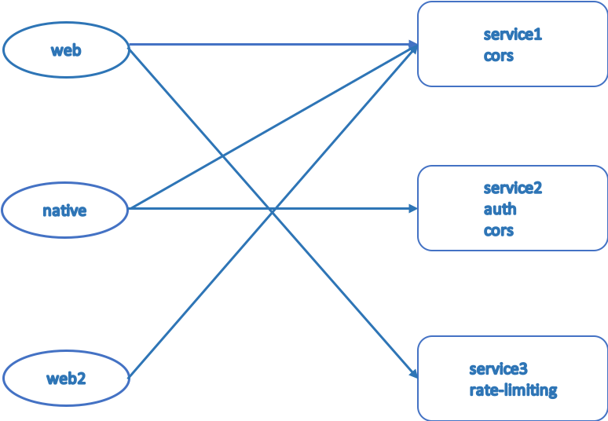

# API 网关介绍
## 为何需要 API 网关
### 没有 API 网关之前的服务架构

在没有 API 网关之前,各个客户端直接对接服务端，特别是在微服务架构下，一个 web 服务有可能要对接十几个甚至二十几个后端服务，这样就会出现明显两个问题

* 安全问题: 每一个服务都对外暴露一个地址，这样当服务越来越多，安全性就成了一个令人头疼的问题了。
* 功能冗余: 每个服务里都需要提供一些和业务代码无关的功能：跨域、鉴权、限流...，这些功能在各个业务线冗余并且无法被不同语言重用，每个语言都需要实现一套相应的功能。

API 网关的出现就能很好的解决不限上面所列的两个缺点
## API 网关是什么
### API 网关架构

API 网关作为一个服务，是流量的统一入口，并且还会将一些和业务代码不相关的冗余功能上升到 API 网关层面，这样就能够减少代码冗余，提高业务开发效率，并且也不存在跨语言的问题。

另外除了上述所说，还有的应该划分于业务网关进行服务的聚合。还有根据调用方分位不同的网关：web|h5、native 等。
甚至还有做正向代理的网关。

## 接下来
你可以继续查看 [kong 网关名词介绍](item.md)

