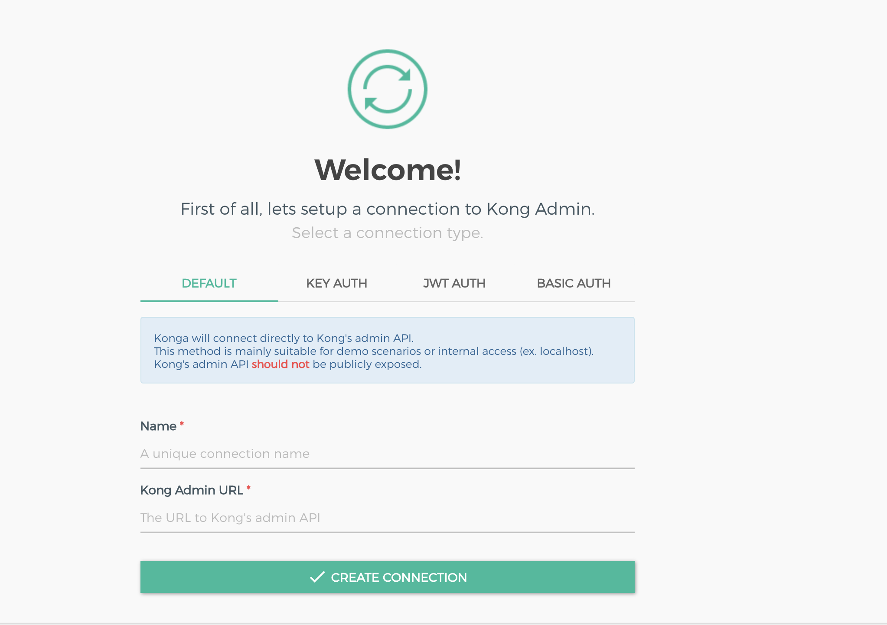
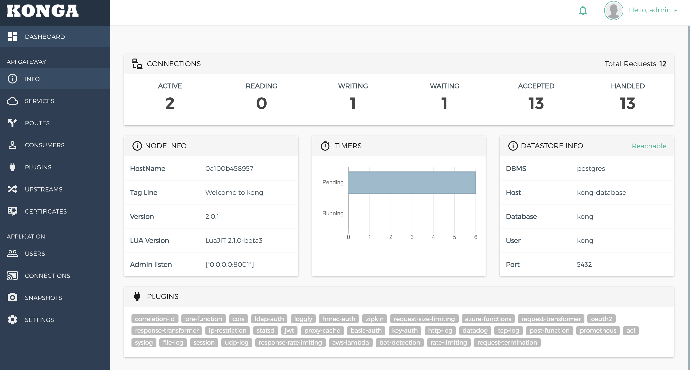
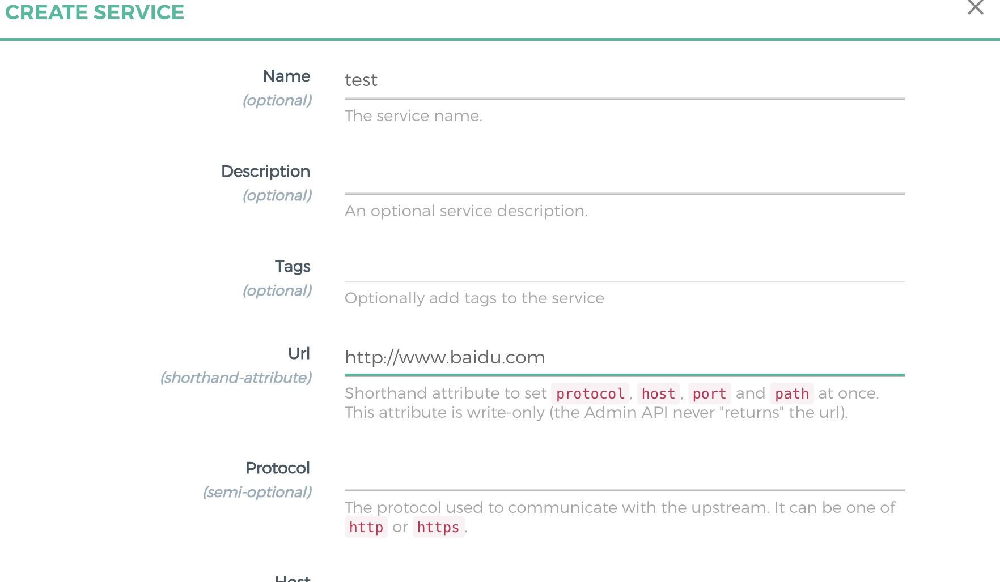
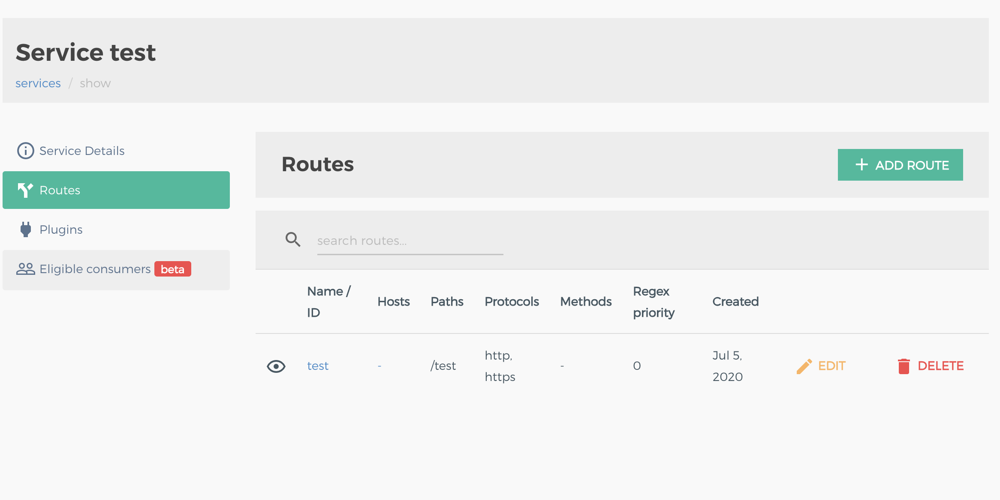

# API 网关系列--Kong 介绍、安装、使用
kong 是基于 openresty 与 nginx 的一款 API 网关，有开源和付费两个版本，这里只针对开源版.

## 主要名词与使用
* Service: 服务是一个具体的后端服务实体或者是一个 API，最主要的就是 URL：后端服务的地址，所有匹配到该服务的请求都会被代理到 URL 上，与之相搭配的还有 protocol, host,port 以及 path
* Route: 路由定义了一个请求是否以及如何被代理到服务上，一个 Service 可以有多个 Route.
* Plugin: 插件，提供网关其他功能，例如：跨域、鉴权、限流等等，插件既可以作用于 Service 也可以作用于 Route，还可以作用于全局。
## 部署架构
kong 部署架构目前提供了三种模式，db 的有两种，db-less 一种。
### db 部署方式
推荐使用 postgresql
### db-less 部署方式
使用 yaml 配置文件，每次修改都需要修改 yaml 文件并导入。
优点：不依赖 db
缺点：需要维护各个节点的 yaml 文件,并且目前只支持一个 yaml 文件，当接入服务越来越大，yaml 文件也会变得难以维护。
## 安装
### 安装方式
官方 2.0 版本之前都是采用的 db 方式:即将配置存储到 某一 db 中，官方支持的是 cassandra 和 postgres, 2.0 开始支持 db-less，以及为了防止集群过大与数据库连接过多，采用分离的部署方式：数据平面和控制平面。
我这里使用 db 方式，db 采用 postgresql 安装方式官网提供了不同方式，这里我选择用 docker 的方式。(假设你已经有了 [docker](https://docs.docker.com/get-docker/) 和 [postgresql](https://hub.docker.com/_/postgres)，公司内部都会有专门的 DBA 来维护，本地测试可以自己搭建一个)。
* 安装
 提供了几个简单的脚本分别运行 db、kong、konga
 [db.sh](script/db.sh)
 [start.sh](script/start.sh)
 [konga.sh](script/konga.sh)
安装很简单，利用 docker 方式可以说是一键拉起了：这里提供个简单的脚本，初次执行：
```
sh db.sh
sh start.sh 2.0.1 init
sh start.sh 2.0.1 start
```
后续需要升级则运行
```
sh start.sh 2.0.1 mup
sh start.sh 2.0.1 start
sh start.sh 2.0.1 mdone
```

启动成功执行看到如下结果即成功运行了。
```
❯ curl localhost:8000
{"message":"no Route matched with those values"}
```


## konga 使用
官方自带的 DashBoard 非常难用，个人比较倾向于一个开源的管理界面：[konga](https://github.com/pantsel/konga),运行起来也比较方便：

启动起来之后，我们在浏览器打开： localhost:1337 即可，第一次登陆需要创建一个管理员账户：,登陆过后需要填写 kong 管理界面的地址：


首页是 kong 集群的信息，包括集群状态，开启的插件等等。左边栏就是 kong 的 service、routes、consumer 等管理界面.

这里我们点击创建个 test 服务，然后再创建个 route，其他字段后续再详解。


这时我们再运行```curl localhost:8000/test``` 就得到百度的页面源码。在浏览器输入 ```localhost:8000/test``` 并回车我们就会等到百度首页，就是这么简单。